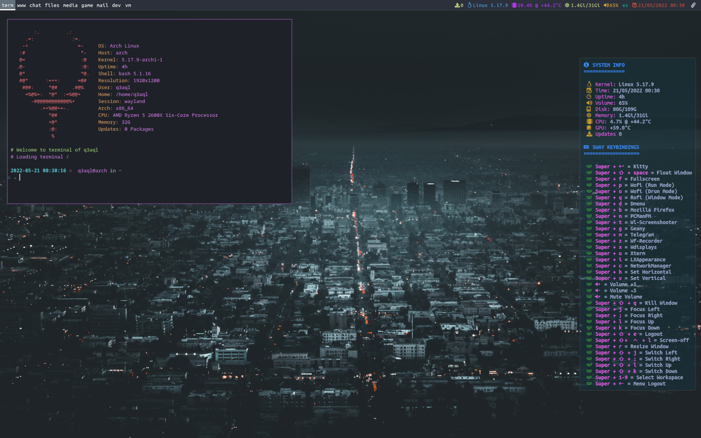

dotfiles - My tiling sway configuration (for Arch/Devuan/Debian)
================================================================

### My configurations:

* [Qtile](README-qtile.md)
* [i3 + polybar](README-i3-polybar.md)
* [i3 + i3status](README-i3.md)
* [i3 + i3blocks](README-i3-i3blocks.md)
* [sway](README-sway.md)
* [spectrwm](README-spectrwm.md)
* [spectrwm + polybar](README-spectrwm-polybar.md)



### Installation:

  * **`Install dependencies:`**
  
    * Read [`How install dependencies on Arch and Devuan/Debian`](Dependencies.md)
      
  * **`Install configuration (dotfiles):`**
  
    * Clone repository and copy files to your home:

      ```shell
      $ git clone https://github.com/q3aql/dotfiles
      $ cd dotfiles
      $ chmod +x install-config.sh
      $ ./install-config.sh
      ````

### Configuration:

  * **`Network Manager (Connman or NetWorkManager):`**
  
    * By default is enabled `NetWorkManager` as network manager:
    * If you prefer `Connman`, edit the file `~/.config/sway/config`:
    
      ```shell
      #exec --no-startup-id connman-gtk --tray &
      exec --no-startup-id nm-applet &
      ````

  * **`Monitor & resolution:`**
  
    * The configuration load my monitor configuration:
    * Use the command `wlr-randr` for show your config & edit the file `~/.config/sway/startwlrrandr.sh`:
    
      ```shell
      wlr-randr --output DP-1 --custom-mode 1280x1024@75Hz --pos 288,0
      wlr-randr --output DP-2 --custom-mode 1280x1024@75Hz --transform 90 --pos 1568,0
      ````

  * **`Screensaver:`**
  
    * The configuration file use my monitor configuration and set the time in 20 minutes:
    * Use the command `wlr-randr` for show your monitors & edit the file `~/.config/sway/startwlrscreensaver.sh`:
    
      ```shell
      # Basic configuration variables
      ScreensaverTime="1200" # 20 minutes
      monitorOne="DP-1" # First monitor
      monitorTwo="DP-2" # Second monitor
      monitorThree="" # Third monitor
      ````

 * **`Wallpaper:`**
  
    * By default, the config load wallpaper on `~/wallpapers/dark-city.jpg`:
    * Edit  `~/.config/sway/config` for set your favorite wallpaper:
    
      ```shell
      exec --no-startup-id "swaybg -i ~/wallpapers/dark-city.jpg -m fill"
      ````

  * **`Layout:`**
  
    * By default, the config load my spanish layout.:
    * Edit  `~/.config/sway/config` for set your configuration:
    
      ```shell
      # Input layout
      input * {
        #xkb_layout "us"
        xkb_layout "es"
        #xkb_variant "colemak"
      }
      ````

### Keys configuration:

My list of extra combinations:

    - Super + d = Open Dmenu
    - Super + p = Open Wofi (run mode)
    - Super + q = Open Rofi (window mode)
    - Super + o = Open Wofi (drun mode)
    - Super + b = Open Firefox
    - Super + n = Open PCManFM
    - Super + t = Open Wayland-Screenshooter
    - Super + g = Open Geany
    - Super + m = Open Telegram 
    - Super + z = Open Wf-Recorder (Screen video recorder) 
    - Super + x = Open Wdisplays
    - Super + u = Open Xterm
    - Super + i = Open LXAppearance
    - Super + c = Open NetWorkManager
    - Volume-Up = Volume +5
    - Volume-Down = Volume -5
    - VolumeMute = Mute Volume
    - Super + Ctrl + Shift + l = Poweroff/Start screen (Screensaver step needed)
    - Super + Shift + e = Logout
    - Super + Backspace = Open menu Logout/Reboot/Shutdown

### External links:

* [Antonio Sarosi](https://github.com/antoniosarosi/dotfiles/)
* [Derek Taylor](https://gitlab.com/dwt1/dotfiles/)
* [TWB0109](https://github.com/TWB0109/PDots)
* [i3-style](https://github.com/altdesktop/i3-style)
* [addy-dclxvi](https://github.com/addy-dclxvi/i3-starterpack)
* [i3-gaps](https://github.com/Airblader/i3)
