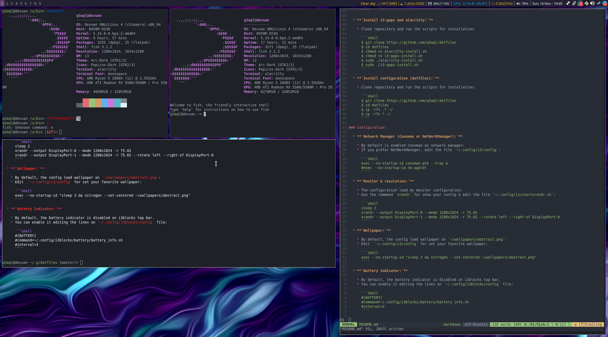

dotfiles - My tiling i3 WM Configuration (for Devuan/Debian)
============================================================



### Installation:

  * **`Install dependencies:`**
  
    * Open the terminal and type the following commands:
    
      ```shell
      $ sudo apt-get install i3 i3status i3blocks i3-wm i3pystatus i3lock i3lock-fancy \
        compton arc-theme breeze-cursor-theme fonts-noto papirus-icon-theme lxappearance \
        nitrogen lxrandr pnmixer conky xterm exa fish bat zsh dmenu fzf apcalc rofi picom \
        engrampa xarchiver mpv ffmpeg pcmanfm ranger vlc vim geany git nodejs node-base \
        python3 npm make cmake gcc cargo neofetch screenfetch lm-sensors \
        xfce4-screenshooter xscreensaver
      ````
    * I use `Connman` instead of `NetWorkManager` (don't install if you prefer NetWorkManager):

      ```shell
      $ sudo apt-get install connman connman-gtk connman-ui connman-vpn
      ````
      
  * **`Install i3-gaps and alacritty:`**
  
    * Clone repository and run the scripts for installation:

      ```shell
      $ git clone https://github.com/q3aql/dotfiles
      $ cd dotfiles
      $ chmod +x alacritty-install.sh
      $ chmod +x i3-gaps-install.sh
      $ sudo ./alacritty-install.sh
      $ sudo ./i3-gaps-install.sh
      ````

  * **`Install configuration (dotfiles):`**
  
    * Clone repository and copy files to your home:

      ```shell
      $ git clone https://github.com/q3aql/dotfiles
      $ cd dotfiles
      $ cp -rfv .* ~/
      $ cp -rfv * ~/
      ````

### Configuration:

  * **`Network Manager (Connman or NetWorkManager):`**
  
    * By default is enabled Connman as network manager:
    * If you prefer NetWorkManager, edit the file `~/.config/i3/config`:
    
      ```shell
      exec --no-startup-id connman-gtk --tray &
      #exec --no-startup-id nm-applet
      ````

  * **`Monitor & resolution:`**
  
    * The configuration load my monitor configuration:
    * Use the command `xrandr` for show your config & edit the file `~/.config/i3/startxrandr.sh`:
    
      ```shell
      sleep 2
      xrandr --output DisplayPort-0 --mode 1280x1024 -r 75.02
      xrandr --output DisplayPort-1 --mode 1280x1024 -r 75.02 --rotate left --right-of DisplayPort-0
      ````

  * **`Wallpaper:`**
  
    * By default, the config load wallpaper on `~/wallpapers/abstract.png`:
    * Edit  `~/.config/i3/config` for set your favorite wallpaper:
    
      ```shell
      exec --no-startup-id "sleep 3 && nitrogen --set-centered ~/wallpapers/abstract.png"
      ````

  * **`Battery Indicator:`**
  
    * By default, the battery indicator is disabled on i3blocks top bar.
    * You can enable it editing the lines on `~/.config/i3blocks/config` file:
    
      ```shell
      #[BATTERY]
      #command=~/.config/i3blocks/battery/battery_info.sh
      #interval=3
      ````

### Keys configuration:

My list of extra combinations:

    - Win + d = Open Dmenu
    - Win + x = Open Rofi (run mode)
    - Win + c = Open Rofi (window mode)
    - Win + o = Open Rofi (drun mode)
    - Win + b = Open Firefox
    - Win + n = Open PCManFM
    - Win + p = Open Screenshot
    - Win + g = Open Geany
    - Win + m = Open Telegram 
    - Win + z = Open Signal 
    - Win + u = Open UXterm
    - Win + t = Open Xterm
    - Win + i = Open LXAppearance
    - Win + Ctrl + Shift + e = Poweroff screen
    - Win + Shit + e = Logout
    - Win + Backspace = Open menu Logout/Lock/Reboot/Shutdown

### External links:

* [Antonio Sarosi](https://github.com/antoniosarosi/dotfiles/)
* [i3-style](https://github.com/altdesktop/i3-style)
* [addy-dclxvi](https://github.com/addy-dclxvi/i3-starterpack)
* [i3-gaps](https://github.com/Airblader/i3)
