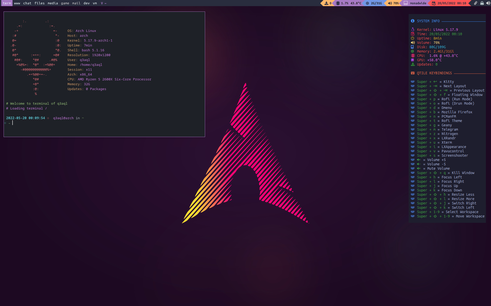

dotfiles - My tiling Qtile, Spectrwm, i3, Dwm & Sway configurations (for Arch/Devuan/Debian)
============================================================================================

### My configurations:

* [Qtile](README-qtile.md)
* [i3](README-i3.md)
* [Sway](README-sway.md)
* [Dwm](README-dwm.md)
* [Spectrwm](README-spectrwm.md)



### Installation:

  * **`Install dependencies:`**
  
    * Read [`How install dependencies on Arch and Devuan/Debian`](Dependencies.md)

  * **`Install configuration (dotfiles):`**
  
    * Clone repository and copy files to your home:

      ```shell
      $ git clone https://github.com/q3aql/dotfiles
      $ cd dotfiles
      $ chmod +x install-config.sh
      $ ./install-config.sh
      $ sudo pip psutils
      ````

### Configuration:

  * **`Network Manager (Connman or NetWorkManager):`**
  
    * By default is enabled `NetWorkManager` as network manager:
    * If you prefer `Connman`, edit the file `~/.config/qtile/autostart.sh`:
    
      ```shell
      #connman-gtk --tray &
      nm-applet
      ````

  * **`Monitor & resolution:`**
  
    * The configuration load my monitor configuration:
    * Use the command `xrandr` for show your config & edit the file `~/.config/qtile/startxrandr.sh`:
    
      ```shell
      sleep 2
      xrandr --output DisplayPort-0 --mode 1920x1200 -r 59.95
      xrandr --output DisplayPort-1 --mode 1280x1024 -r 75.02 --rotate left --right-of DisplayPort-0
      ````

  * **`Wallpaper:`**
  
    * By default, the config load wallpaper on `~/wallpapers/archlinux2.jpg`:
    * Edit  `~/.config/qtile/autostart.sh` for set your favorite wallpaper:
    
      ```shell
      sleep 3 && nitrogen --head=0 --set-scaled ~/wallpapers/archlinux2.jpg
      nitrogen --head=1 --set-zoom-fill ~/wallpapers/archlinux2.jpg
      ````

 * **`Set Screensaver (Optional):`**

    * The configuration file set `xautolock` with 20 minutes as screensaver:
    * You can change the program between `xautolock` and `xscreensaver` editing the file `~/.config/qtile/startscreensaver.sh`:

      ```shell
      # Basic configuration variables
      ScreensaverProgram="xautolock" # Options: xautolock or xscreensaver
      ScreensaverTime="20" # 20 minutes (only for xautolock)
      ````
### Keys configuration:

My list of extra combinations:

    - Super + Tab = Next Layout
    - Super + Shift + Tab = Previous Layout
    - Super + Shift + f = Floating Window
    - Super + p = Open Rofi (run mode)
    - Super + q = Open Rofi (window mode)
    - Super + o = Open Rofi (drun mode)
    - Super + b = Open Firefox
    - Super + n = Open PCManFM
    - Super + t = Open Rofi Theme Selector
    - Super + g = Open Geany
    - Super + m = Open Telegram 
    - Super + z = Open Nitrogen 
    - Super + x = Open LXRandr
    - Super + u = Open Xterm
    - Super + i = Open LXAppearance
    - Super + s = Open Screenshooter
    - Volume-Up = Volume +5
    - Volume-Down = Volume -5
    - VolumeMute = Mute Volume
    - Super + Shift + q = Shutdown

### External links:

* [Antonio Sarosi](https://github.com/antoniosarosi/dotfiles/)
* [Derek Taylor](https://gitlab.com/dwt1/dotfiles/)
* [TWB0109](https://github.com/TWB0109/PDots)
* [i3-style](https://github.com/altdesktop/i3-style)
* [addy-dclxvi](https://github.com/addy-dclxvi/i3-starterpack)
* [i3-gaps](https://github.com/Airblader/i3)
