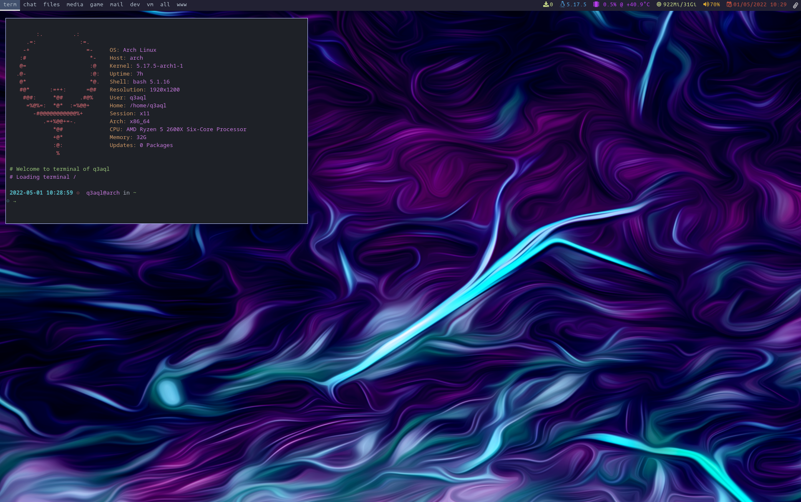

dotfiles - My tiling spectrwm & i3 configurations (for Devuan/Debian)
=====================================================================

### My configurations:

* [spectrwm](README.md)
* [spectrwm + polybar](README-spectrwm-polybar.md)
* [i3 + i3status](README-i3.md)
* [i3 + i3blocks](README-i3-i3blocks.md)
* [i3 + polybar](README-i3-polybar.md)



### Installation:

  * **`Install dependencies:`**
  
    * Open the terminal and type the following commands:
    
      ```shell
      $ sudo apt-get install spectrwm compton arc-theme breeze-cursor-theme \
        fonts-noto papirus-icon-theme lxappearance nitrogen lxrandr pnmixer tint2 \
        conky xterm exa fish bat zsh dmenu fzf apcalc rofi picom engrampa ristretto \
        xarchiver mpv ffmpeg pcmanfm ranger vlc vim geany git nodejs node-base \
        python3 npm make cmake gcc cargo neofetch screenfetch lm-sensors pavucontrol \
        xfce4-screenshooter xscreensaver alsa-utils pulseaudio-utils light xbacklight
      ````
    * I use `Connman` instead of `NetWorkManager` (`don't install if you prefer or use NetWorkManager`):

      ```shell
      $ sudo apt-get install connman connman-gtk connman-ui connman-vpn
      ````
      
    * For install `alacritty`, type this commands:
    
      ```shell
      $ git clone https://github.com/q3aql/dotfiles
      $ cd dotfiles
      $ chmod +x alacritty-install.sh
      $ sudo ./alacritty-install.sh
      ````

  * **`Install configuration (dotfiles):`**
  
    * Clone repository and copy files to your home:

      ```shell
      $ git clone https://github.com/q3aql/dotfiles
      $ cd dotfiles
      $ cp -rfv .* ~/
      $ cp -rfv * ~/
      ````

### Configuration:

  * **`Network Manager (Connman or NetWorkManager):`**
  
    * By default is enabled `NetWorkManager` as network manager:
    * If you prefer Connman, edit the file `~/.config/spectrwm/spectrwm.conf` and `autostart.sh`:
    
      ```shell
      # Choose between NetworkManager or Connman
      program[connection]   = nm-connection-editor
      #program[connection]   = connman-gtk --no-icon
      bind[connection]      = MOD+c
      ````

      ```shell
      # Network Tray (Use Win + Shift + t to show it)
      nm-applet &
      #connman-gtk --tray &
      ````

  * **`Monitor & resolution:`**
  
    * The configuration load my monitor configuration:
    * Use the command `xrandr` for show your config & edit the file `~/.config/spectrwm/startxrandr.sh`:
    
      ```shell
      xrandr --output DisplayPort-0 --mode 1280x1024 -r 75.02
      xrandr --output DisplayPort-1 --mode 1280x1024 -r 75.02 --rotate left --right-of DisplayPort-0
      ````

  * **`Wallpaper:`**
  
    * By default, the config load wallpaper on `~/wallpapers/abstract.png`:
    * Edit  `~/.config/spectrwm/startwallpaper.sh` for set your favorite wallpaper:
    
      ```shell
      sleep 3
      nitrogen --set-scaled ~/wallpapers/abstract.png
      ````

  * **`Compositor (Compton or Picom):`**
  
    * By default, the config load `Picom` compositor.
    * You can change it editing the lines on `~/.config/spectrwm/startcompositor.sh` file:
    
      ```shell
      # Load compton or picom (Compositor)
      sleep 15
      #compton &
      picom &
      ````

### Keys configuration:

My list of extra combinations:

    - Super + d = Open Rofi Theme selector
    - Super + x = Close Window
    - Super + w = Minimize Window
    - Super + Shift + w = Maximize/Search Window
    - Super + Shift + t = Show/Hide Tray (Run by default on Workspace 7)
    - Super + c = Open network configuration
    - Super + v = Open volume configuration (Pavucontrol)
    - Super + Return = Open terminal (Alacritty)
    - Super + n = Open PCManFM
    - Super + p = Open Rofi (exec program)
    - Super + o = Open Rofi (exec menu program)
    - Super + z = Open Wallpaper selector (Nitrogen)
    - Super + x = Open LXRandr
    - Super + u = Open Xterm
    - Super + i = Open LXAppearance
    - Super + s = Open Xfce4-Screenshot
    - Super + Delete = Poweroff screen
    - Super + Shift + Delete = Close session
    - Volume-Up = Volume +5
    - Volume-Down = Volume -5
    - VolumeMute = Mute Volume
    - BrightnessUp = Brightness +10
    - BrightnessDown = Brightness -10

### External links:

* [Antonio Sarosi](https://github.com/antoniosarosi/dotfiles/)
* [Derek Taylor](https://gitlab.com/dwt1/dotfiles/)
* [TWB0109](https://github.com/TWB0109/PDots)
* [i3-style](https://github.com/altdesktop/i3-style)
* [addy-dclxvi](https://github.com/addy-dclxvi/i3-starterpack)
* [i3-gaps](https://github.com/Airblader/i3)
